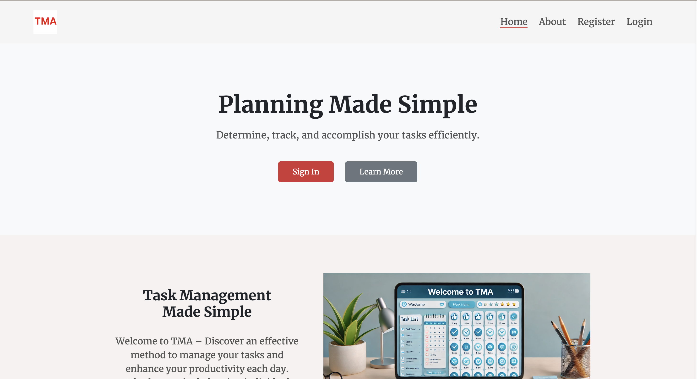
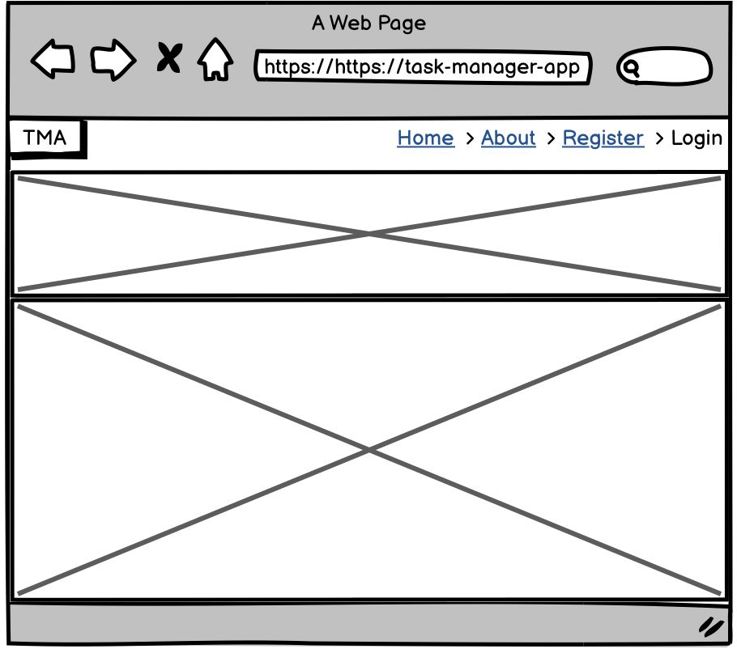
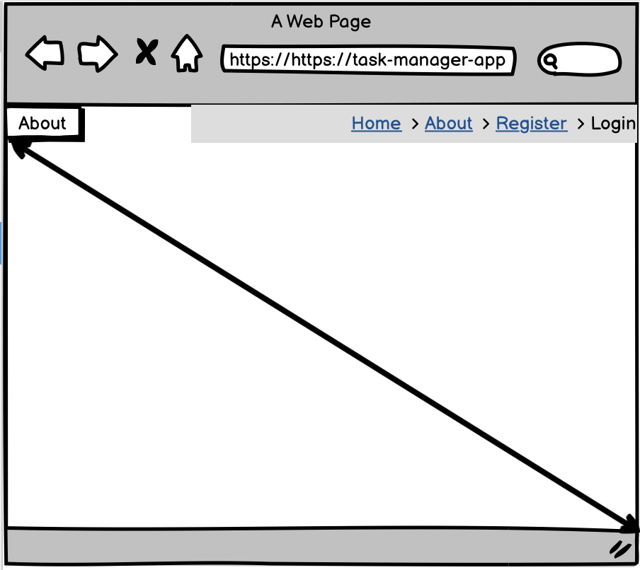
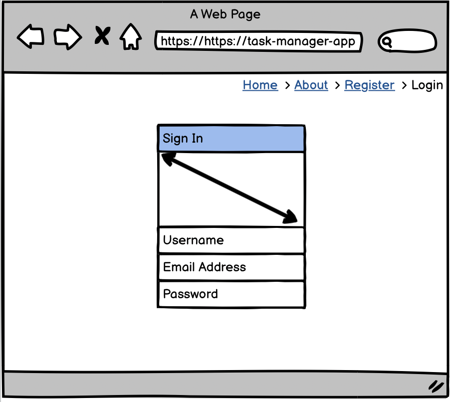
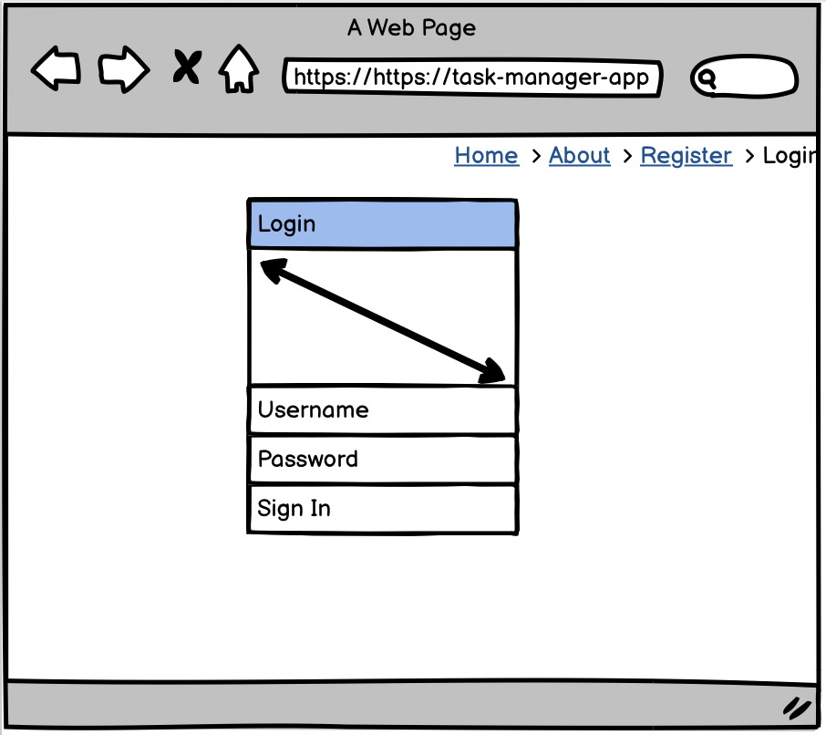
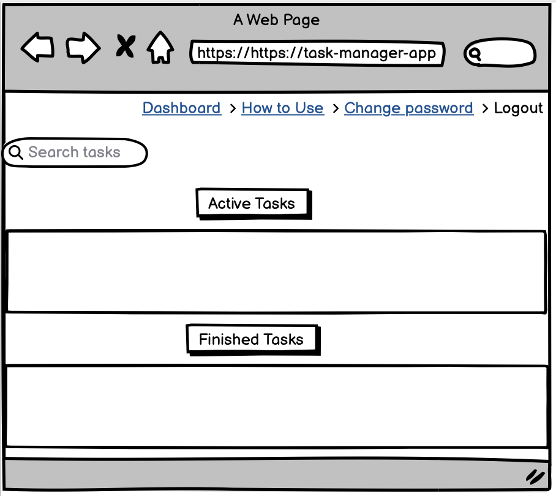

TMA - Task  Manager App

TMA is an intuitive task management application designed to assist individuals and teams in efficiently organising and prioritising their task With features such as project tagging and customisable task statuses, TMA enhances workflow management, enabling users to focus on what truly matters.

## Live website

The live link can be found here - [TMA](https://task-manager-app1-40e039bd7af8.herokuapp.com/) 



## Table of Contents
- [TMA](#tma)
  - [Purpose of the project](#purpose-of-the-project)
  - [Table of Contents](#table-of-contents)
- [UX/UI](#ux---user-expirience)
  - [User Stories](#user-stories)
  - [Design Inspiration](#design-inspiration)
  - [Wireframes](#wireframes)
  - [Final View](#final-view)
- [Database Schema - Entity Relationship Diagram](#database-schema---entity-relationship-diagram)
- [Agile Methodologies - Project Management](#agile-methodologies---project-management)
  - [MoSCoW Prioritisation](#moscow-prioritisation)
- [Deployment](#deployment)
  - [Connecting to GitHub](#connecting-to-github)
  - [Django Project Setup](#django-project-setup)
  - [Cloudinary API](#cloudinary-api)
  - [Heroku deployment](#heroku-deployment)
- [Technologies Used](#technologies-used)
- [Testing](#testing)
  - [Validator testing](#validator-testing)
    - [HTML](#html)
    - [CSS](#css)
    - [JavaScript](#javascript)
    - [Python](#python-validation)
  - [Manual Testing](#manual-testing)
- [Credits](#credits)
  - [Content](#content)


# UX - User Expirience

## User Stories:

| User Story | Priority |
|----------------------------------------------------------------------------------------------------------------------------|---------------|
| As a user, I can register and login, so that i can save my tasks and access them. | **MUST HAVE** |
| As a User, I can able to mark finish, so that finished task move to finished container. | **MUST HAVE** |
| As a user, I can able to view list of all tasks, so that i can able to see where all the tasks in Ongoing or Finished | **MUST HAVE** |
| As a user, I can able to delete tasks, so that i can remove successfully finished tasks or unuseful tasks. | **MUST HAVE** |
| As a user, I can able to add new tasks to the task management dashboard, so that i can track the tasks i need to finish. | **MUST HAVE** |
| As a user, I can able to prioritise task, so that i can focus on the important task. | **SHOULD HAVE** |
| As a user, I can able to edit tasks, so that i can update tasks. | **SHOULD HAVE** |
| As a user, I can able to search for tasks by their title, so that i can find a specific tasks. | **COULD HAVE** |  

## Design Inspiration
  

https://chromewebstore.google.com/detail/colorblind-dalton-for-goo/afcafnelafcgjinkaeohkalmfececool?hl=en


### Font

Using [Google Font](<https://fonts.google.com/>), i imported "Merriweather" to the CSS file and set it as the default font. 

## Wireframes

__Browser View:__

<details open>
    <summary>Home page</summary>  
      
</details>

<details open>
    <summary>About</summary>  
      
</details>

<details open>
    <summary>SignIn</summary>  
      
</details>

<details open>
    <summary>log In</summary>  
      
</details>

<details open>
    <summary>Dashboard</summary>  
       
</details>

# Mobile View


# Database Schema - Entity Relationship Diagram

The Entity-Relationship Diagram (ERD) for TMA showcases the connections between users, tasks and articles. It also highlights that only admin or staff users have the privilege to add content to the home page. 
This diagram is crucial in visualising the relationships among various models within the PostgreSQL database.


The above ERD was generated using Python Extension - pygraphviz and pydotplus. 
Documentation at [Django-extensions>Graph models](<https://django-extensions.readthedocs.io/en/latest/graph_models.html>).

# Agile Methodologies - Project Management

I used my [Github Projects Board](<https://github.com/users/Vishalchapa/projects/11>) to plan and document all of work, initially I started with a [Miro board] board to allow ourselves to make some mistakes and gather any scraps of notes or information that I had and then refined them into Projects board.


## MoSCoW Prioritisation

I chose to follow the MoSCoW Prioritisation method for Freefido, identifying and labelling my:

 - __Must Haves:__ the 'required', critical components of the project. Completing 'Must Haves' helped to reach the MVP (Minimum Viable Product) for this project early, allowing to develop the project further than originally planned.

 - __Should Haves:__ the components that are valuable to the project but not absolutely 'vital' at the MVP stage. The 'Must Haves' must receive priority over the 'Should Haves'.

 - __Could Haves:__ these are the features that are a 'bonus' to the project, it would be nice to have them in this phase, but only if the most important issues have been completed first and time allows.


# Deployment

## Connecting to GitHub  

To begin this project from scratch, you must first create a new GitHub repository using the [Code Institute's Template](https://github.com/Code-Institute-Org/ci-full-template). This template provides the relevant tools to get you started. To use this template:

1. Log in to [GitHub](https://github.com/) or create a new account.
2. Navigate to the above CI Full Template.
3. Click '**Use this template**' -> '**Create a new repository**'.
4. Choose a new repository name and click '**Create repository from template**'.
5. In your new repository space, click the purple CodeAnywhere (if this is your IDE of choice) button to generate a new workspace.

## Django Project Setup

1. Install Django and supporting libraries: 
   
- ```pip3 install 'django<4' gunicorn```
- ```pip3 install dj_database_url psycopg2```
- ```pip3 install dj3-cloudinary-storage```  
  
2. Once you have installed any relevant dependencies or libraries, such as the ones listed above, it is important to create a **requirements.txt** file and add all installed libraries to it with the ```pip3 freeze --local > requirements.txt``` command in the terminal.  
3. Create a new Django project in the terminal ```django-admin startproject tma .```
4. Create a new app eg. ```python3 mangage.py startapp tasks```
5. Add this to list of **INSTALLED_APPS** in **settings.py** - 'review',
6. Create a superuser for the project to allow Admin access and enter credentials: ```python3 manage.py createsuperuser```
7. Migrate the changes with commands: ```python3 manage.py migrate```
8. An **env.py** file must be created to store all protected data such as the **DATABASE_URL** and **SECRET_KEY**. These may be called upon in your project's **settings.py** file along with your Database configurations. The **env.py** file must be added to your **gitignore** file so that your important, protected information is not pushed to public viewing on GitHub. For adding to **env.py**:

- ```import os```
- ```os.environ["DATABASE_URL"]="<copiedURLfromCI>"```
- ```os.environ["SECRET_KEY"]="my_super^secret@key"```

For adding to **settings.py**:

- ```import os```
- ```import dj_database_url```
- ```if os.path.exists("env.py"):```
- ```import env```
- ```SECRET_KEY = os.environ.get('SECRET_KEY')``` (actual key hidden within env.py)  

9. Replace **DATABASES** with:

```
DATABASES = {
    'default': dj_database_url.parse(os.environ.get("DATABASE_URL"))
  }
```

10. Set up the templates directory in **settings.py**:
- Under ``BASE_DIR`` enter ``TEMPLATES_DIR = os.path.join(BASE_DIR, ‘templates’)``
- Update ``TEMPLATES = 'DIRS': [TEMPLATES_DIR]`` with:

```
os.path.join(BASE_DIR, 'templates'),
os.path.join(BASE_DIR, 'templates', 'allauth')
```

- Create the media, static and templates directories in top level of project file in IDE workspace.

11. A **Procfile** must be created within the project repo for Heroku deployment with the following placed within it: ```web: gunicorn tma.wsgi```
12. Make the necessary migrations again.

## Cloudinary API 

Cloudinary provides a cloud hosting solution for media storage. All uploaded images for the menu items are hosted here.

Set up a new account at [Cloudinary](https://cloudinary.com/) and add your Cloudinary API environment variable to your **env.py** and Heroku Config Vars.
In your project workspace: 

- Add Cloudinary libraries to INSTALLED_APPS in settings.py 
- In the order: 
```
   'cloudinary_storage',  
   'django.contrib.staticfiles',  
   'cloudinary',
```
- Add to **env.py** and link up with **settings.py**: ```os.environ["CLOUDINARY_URL"]="cloudinary://...."``` 
- Set Cloudinary as storage for media and static files in settings.py:
- ```STATIC_URL = '/static/'```
```
  STATICFILES_DIRS = [os.path.join(BASE_DIR, 'static'), ]  
  STATIC_ROOT = os.path.join(BASE_DIR, 'staticfiles')‌  
```

## Heroku deployment

To start the deployment process , please follow the below steps:

1. Log in to [Heroku](https://id.heroku.com/login) or create an account if you are a new user.
2. Once logged in, in the Heroku Dashboard, navigate to the '**New**' button in the top, right corner, and select '**Create New App**'.
3. Enter an app name and choose your region. Click '**Create App**'. 
4. In the Deploy tab, click on the '**Settings**', reach the '**Config Vars**' section and click on '**Reveal Config Vars**'. Here you will enter KEY:VALUE pairs for the app to run successfully. The KEY:VALUE pairs that you will need are your: 
   
   - **CLOUDINARY_URL**: **cloudinary://....** 
   - **DATABASE_URL**:**postgres://...** 
   - **DISABLE_COLLECTSTATIC** of value '1' (N.B Remove this Config Var before deployment),
   -  **PORT**:**8000**
   -  **SECRET_KEY** and value  
  
5. Add the Heroku host name into **ALLOWED_HOSTS** in your projects **settings.py file** -> ```['herokuappname', ‘localhost’, ‘8000 port url’].```
6. Once you are sure that you have set up the required files including your requirements.txt and Procfile, you have ensured that **DEBUG=False**, save your project, add the files, commit for initial deployment and push the data to GitHub.
7. Go to the '**Deploy**' tab and choose GitHub as the Deployment method.
8. Search for the repository name, select the branch that you would like to build from, and connect it via the '**Connect**' button.
9.  Choose from '**Automatic**' or '**Manual**' deployment options, I chose the 'Manual' deployment method. Click '**Deploy Branch**'.
10. Once the waiting period for the app to build has finished, click the '**View**' link to bring you to your newly deployed site. If you receive any errors, Heroku will display a reason in the app build log for you to investigate. **DISABLE_COLLECTSTATIC**  may be removed from the Config Vars once you have saved and pushed an image within your project, as can **PORT:8000**.

# Technologies Used

- HTML5
- CSS3
- Python
  - asgiref==3.8.1
  - gunicorn==20.1.0
  - psycopg==3.2.2
  - PyJWT==2.9.0
  - python3-openid==3.2.0
  - requests-oauthlib==2.0.0
  - sqlparse==0.5.1
  - urllib3==1.26.20
  - whitenoise==5.3.0
- Django
  - dj-database-url==0.5.0
  - Django==4.2.14
  - django-allauth==0.57.2
  - django-crispy-forms==2.3
  - dj3-cloudinary-storage==0.0.6
  - django-extensions==3.2.3
  - django-summernote==0.8.20.0
- Cloudinary
  - cloudinary==1.41.0
- Heroku
- GitHub
- GitHub Projects


# Testing 
## Validator Testing 

### HTML

For my HTML files I have used [HTML W3C Validator](https://validator.w3.org) to validate all of my HTML files.

<hr>

### CSS

[W3C CSS Validator](https://jigsaw.w3.org/css-validator/) was used to validate my CSS file. 

 
<hr>

### JavaScript

[JSHint](https://jshint.com/) was used to validate the small amount of JavaScript code added to the project. External JS, for Bootstrap purposes, obtained via [CDN](https://cdnjs.cloudflare.com/ajax/libs/bootstrap/5.2.3/js/bootstrap.min.js) was not validated through JSHint

<hr>

### Python Validation

[CI Python Linter](https://pep8ci.herokuapp.com/#) was used to validate the Python files that were created or edited by myself.

<hr>

<hr>

# Credits 

## Content 

- The icons in the footer were taken from [Font Awesome](https://fontawesome.com/)
- The CDN framework used for ready-made styling was [Bootstrap 5](https://getbootstrap.com/docs/5.0/getting-started/download/)
- [Balsamiq](https://balsamiq.com/) used for wireframe
- [Perplexity](https://www.perplexity.ai/)
- [Miro](https://miro.com) used for planning the work process
